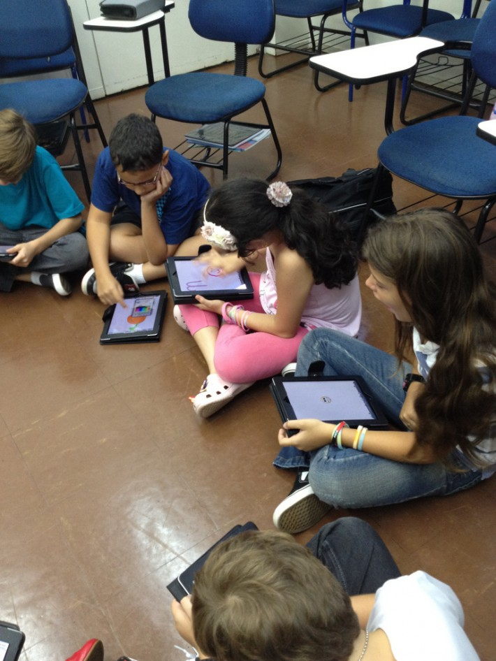

# Algunas orientaciones didácticas

Los dispositivos móviles no  tienen las mismas características que un ordenador convencional (PC o portátil); tienen características y posibilidades diferentes, lo que hace necesario pensar en adaptar o diseñar contenidos y actividades específicas para estos medios. Por citar sólo algunas diferencias, podemos señalar el tamaño de la pantalla; son táctiles, pueden disponer de GPS, la constelación de aplicaciones gratuitas o bajo precio es muy superior a las que nos pueden ofrecer los ordenadores y otras muchas que condicionan el tipo de uso, mucho más versátil que el de un ordenador.

En el monográfico de [Scopeo](http://scopeo.usal.es/monografico-scopeo-no-3/) dedicado al m-learning (1) podemos encontrar algunas recomendaciones para el diseño de actividades y contenidos, recordándonos previamente que un móvil no es un ordenador y por tanto no se trata de hacer lo mismo o de adaptar contenidos, sino que requiere nuevos contenidos y prácticas:

*   _Keep It Short and Simple_ (KISS). Hacer diseños simples y sencillos.
    
*   Reducir la densidad del contenido/información.
    
*   Más fácil con multimedia
    
*   Incluir elementos de colaboración. No olvidar que un móvil es fundamentalmente un instrumento de comunicación y trabajo en equipo.
    
*   No solo contenidos, también aplicaciones. Seleccionar aquellas aplicaciones que pueden ser útiles para la consulta, la creación, la productividad, la comunicación y otro sinfín de utilidades.
    

Queda mucho camino por recorrer en la creación de nuevos contenidos y la adaptación de los ya existentes para que sean accesibles desde los dispositivos móviles.

El m-learning nos proporciona nuevas situaciones de aprendizaje en nuevos contextos. Las actividades y los contenidos de aprendizaje pueden estar fuera del aula, en cualquier momento y lugar, pero también unas grandes posibilidades de interacción y cooperación social entre todos los agentes educativos.

Imagen procedente de: [CTJ Online](https://www.flickr.com/photos/29577217@N05/6899997900/) via [Compfight](http://compfight.com/) [CC BY-NC-ND 2.0](http://creativecommons.org/licenses/by-nc-nd/2.0/)

\_\_\_\_\_\_\_\_\_\_\_\_\_\_\_\_\_\_\_\_\_\_\_\_\_\_\_\_\_\_\_

NOTAS

(1) "Monográficoico SCOPEO No. 3."Observatorio Scopeo. Web. 08 Julio 2014. < [http://scopeo.usal.es/monografico-scopeo-no-3/](http://scopeo.usal.es/monografico-scopeo-no-3/) >.