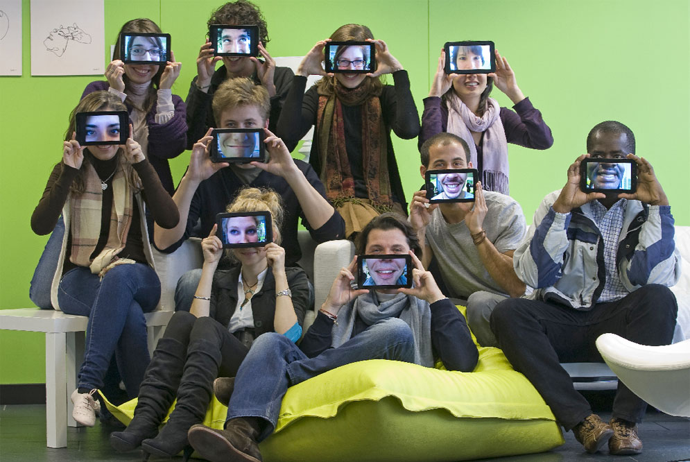

# Algunos inconvenientes

La primera desventaja que presenta el uso de los móviles es el elevado coste que representa la adquisición de dispositivos por parte de los usuarios y el servicio de datos para acceso a Internet, aunque probablemente en un par de cursos se habrá amortizado si lo comparamos con el coste de los libros de texto.

Otro aspecto que dificulta su utilización es el tamaño de la pantalla de los dispositivos que condiciona la usabilidad y navegación por los contenidos, aunque la tendencia por ejemplo en el tamaño de los _smartphones_ más recientes casi no los diferencia de las _tablets_. Esta característica condiciona el diseño de las interfaces y la introducción de datos que han de ser claros, cortos y concisos.

Tampoco resulta fácil encontrar una configuración inicial de modo que todos los dispositivos dispongan de las mismas aplicaciones cuando se utilizan distintos dispositivos y sistemas operativos (1) .  

Los recursos y actividades que utilizan [Flash](http://get.adobe.com/es/flashplayer/) no son compatibles con Ipad y Iphone, y también pueden presentar problemas con dispositivos Android. Este problema cada vez es menor en la medida en que se va extendiendo el uso de [HTML5](http://es.wikipedia.org/wiki/HTML5); los principales proveedores de servicios web ya han hecho este cambio. Herramientas como [JClic](http://clic.xtec.cat/es/jclic/index.htm), [Hot Potatoes](https://hotpot.uvic.ca/), [Malted](http://recursostic.educacion.es/malted/web/), etc, también presentan problemas de visualización y uso en dispositivos móviles.

Alumnos de la Escuela de Organización Industrial de Madrid, con su tableta de aprendizaje. / SANTI BURGOS

Fotografía procedente de ["A la Escuela con la Tableta". El País](http://elpais.com/diario/2011/04/04/radiotv/1301868001_850215.html).

\_\_\_\_\_\_\_\_\_\_\_\_\_\_\_\_\_\_\_\_\_\_\_\_\_

NOTAS

(1) Tendencias emergentes en educación. Artículo de Javier Monteagudo “Dispositivos móviles. El aprendizaje en nuestras manos”. Julio 2014 . <[http://ciberespiral.org/tendencias/Tendencias\_emergentes\_en\_educacin\_con_TIC.pdf](http://ciberespiral.org/tendencias/Tendencias_emergentes_en_educacin_con_TIC.pdf)>