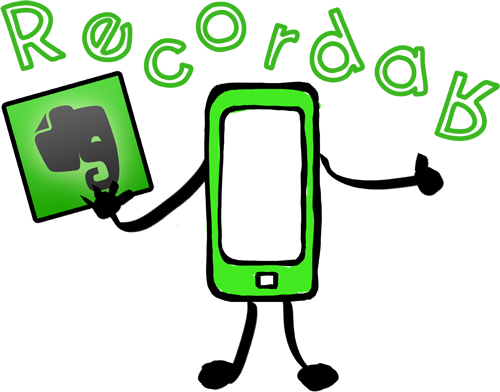

# Aplicaciones Didácticas

**Docentes**

Mediante esta aplicación, podrás:

*   Tomar notas de texto o anotaciones a una fotografía sin necesidad de tener conexión a internet y sincronizarlas con el resto de la agenda cuando consigas conectividad.
*   Guardar ULRs de contenidos digitales, etiquetarlos por el criterio deseado y consultarlos posteriormente.
*   Crear una agenda de eventos próximos: guardias, reuniones, exámenes, ...

**Alumnos**

Mediante esta aplicación, podrás:

*   Grabar las explicaciones del profesor en el aula en una nota de vídeo o de audio.
*   Tomar apuntes sin conexión a internet y compartirlos con tus compañeros cuando dispongas de conexión a internet.
*   Transcribir a texto notas de audio o fotografías de documentos cuando esteś realizando un trabajo escrito.