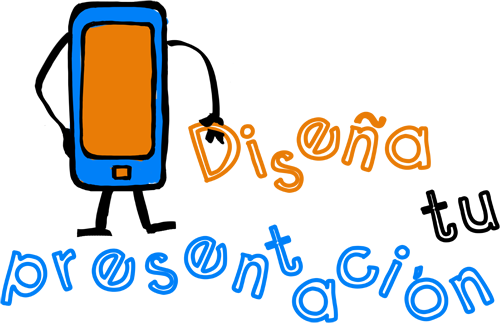

# Aplicaciones Didácticas

**Docentes**

Mediante esta aplicación podrás:

*   Generar presentaciones online de contenidos o experiencias, con un fuerte componente visual.
*   Embeberlas en tu sitio web, blog ..., compartirlas en redes o descargarlas para ponerlas a disposición de los alumnos y los compañeros.

**Alumnos**

Mediante esta aplicación podrás:

*   Elaborar una presentación sobre una temática dada, donde la defensa oral de la misma sea complemente indispensable de la propuesta.
*   Facilitar la presentación a tu profesor mediante correo electrónico o a través de redes sociales.
*   Trabajar la importancia de la estética en la elaboración de presentaciones, donde el protagonismo del contenido recaiga en el orador.