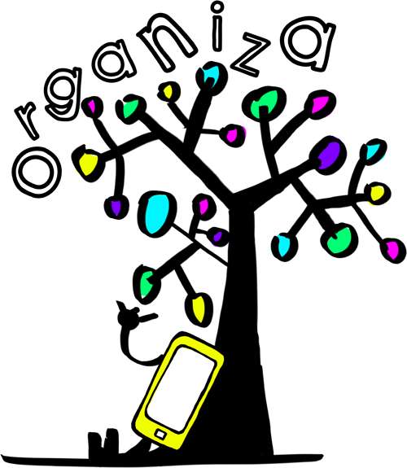

# Aplicaciones Didácticas

**Docentes**

Mediante esta aplicación, podrás:

*   Recopilar colecciones de carácter educativo publicadas por otros docentes.
    
*   Crear colecciones para tus alumnos como ayuda para comprender diversos objetivos de aprendizaje.
    

**Alumnos**

Mediante esta aplicación podrás:

*   Individualmente o en grupos colaborativos, crear colecciones de recursos, notas e imágenes sobre una temática propuesta por el docente.