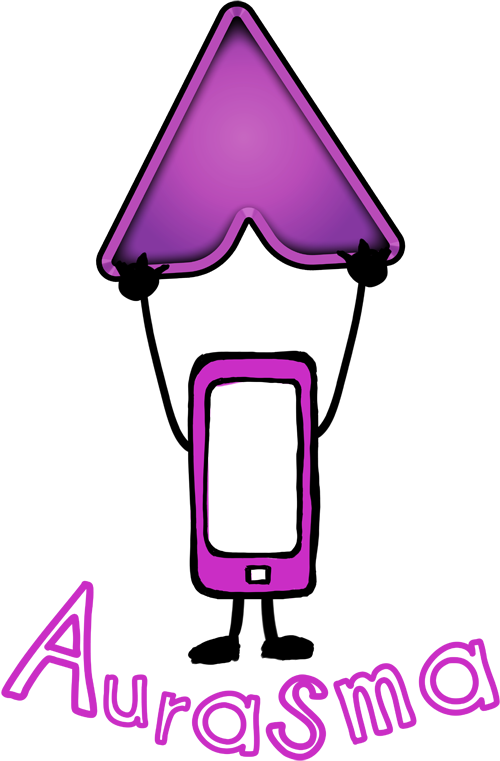

# Aplicaciones Didácticas

**Docentes y Alumnos**

Mediante esta aplicación, podrás:

*   **Aumentar un libro**: escoger una ilustración, gráfico, fórmula… aplicarle un aura que lleve a un vídeo explicativo creado previamente por el profesor.

*   **Crear rincones de trabajo aumentados**: En diversos puntos de la clase se añaden imágenes que tienen un contenido virtual aumentado. Los alumnos pueden llevar a cabo un itinerario siguiendo todos los rincones y así desarrollar el tema de forma autónoma.

*   **Crear auras**: se decide un tema del que se pueda conseguir imágenes (obras pictóricas, animales, elementos químicos, figuras geométricas, escritores…) a cada alumno o equipo de alumnos se les asigna un elemento del proyecto, deben buscar información, redactar un guión, elaborar un vídeo y luego vincular el contenido virtual a la imagen. Se puede crear un mural, expositor, instalación… en la que exponer los trabajos accesibles para ser aumentados.