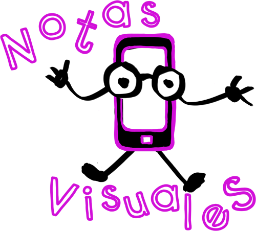

# Aplicaciones Didácticas

**Docentes**

Mediante esta aplicación podrás:

*   Generar documentos, presentaciones u hojas de cálculo, a disposición de tus alumnos y accesibles desde cualquier ordenador, o en tu propio dispositivo.
    
*   Completar de forma colaborativa materiales, en dichos formatos, con compañeros y/o alumnos.
    
*   Proporcionar el enlace del recurso de forma online.
    

**Alumnos**

Mediante esta aplicación podrás:

*   Trabajar de forma colaborativa, con otros compañeros, desde el aula o en casa, haciendo posible el inicio/ proceso de un trabajo/ experiencia.
    
*   Generar documentos, presentaciones u hojas de cálculo, a disposición de tus compañeros/ docente y accesibles desde cualquier ordenador, o en tu propio dispositivo.
    
*   Proporcionar el enlace del recurso de forma online.