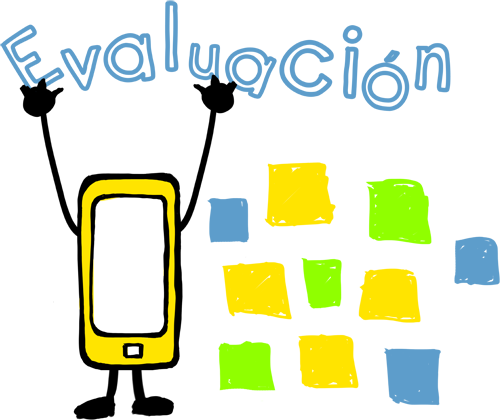

# Aplicaciones Didácticas

**Docentes y Alumnos**

Mediante esta aplicación, podrás:

*   Evaluar propuestas: a la hora de elaborar un proyecto cada equipo puede elaborar un tablero en el que hacer lluvia de ideas o recoger propuestas. Haciendo uso de los colores de los post-it se pueden clasificar entre viables o inviables.
*   Llevar a cabo autoevaluación: El profesor crea un tablero sobre un tema o proyecto. El alumno añade un post-it con su autoevaluación atendiendo a los criterios que se han establecido. Se puede hacer uso de los colores.
*   Crear compilaciones: Los alumnos buscarán recursos o información sobre un tema, se expondrán a un grupo o a la clase y entre todos se valoran y seleccionan los más completos, fiables y útiles. Estos se publican en un tablero tras el consenso. Será un recopilatorio, acordado por todos, para elaborar una monografía, trabajar en un proyecto o preparar un examen.