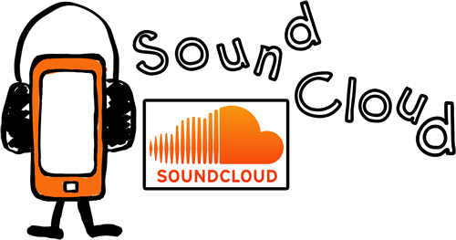

# Aplicaciones Didácticas

**Docentes y Alumnos**

Mediante esta aplicación podrás:

*   **Grabar en directo**: captura tus explicaciones, conferencias o clases magistrales y compártelas para que el alumnado pueda acceder a ellas.
*   **Realizar Comprensión oral**: crea tus propias pistas en idioma extranjero, con el vocabulario de tu plan de estudios, a los que el alumnado puede acceder para practicar.
*   **Crear tu radio escolar**: el alumnado puede grabar canciones, noticias, debates, recitales, etc. Podrá ser utilizada para anunciar eventos escolares, hacer lecturas, practicar idiomas…
*   **Crear AudioGuías**, audiotutoriales, etc.