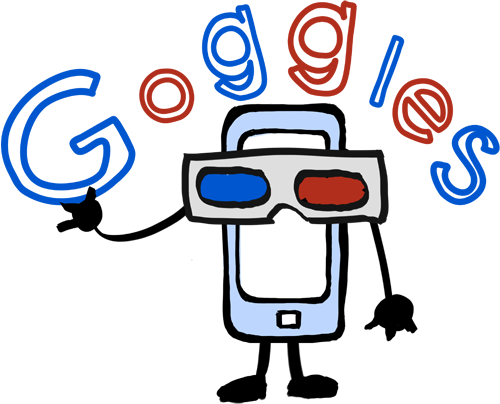

# Aplicaciones Didácticas

**Docentes**

Mediante esta aplicación, podrás:

*   Crear actividades de investigación sobre un contenido, a partir de imágenes que hagas llegar a tus alumnos.

**Alumnos**

Mediante esta aplicación, podrás:

*   Descubrir la historia oculta tras imágenes de ámbito artístico, histórico o científico.