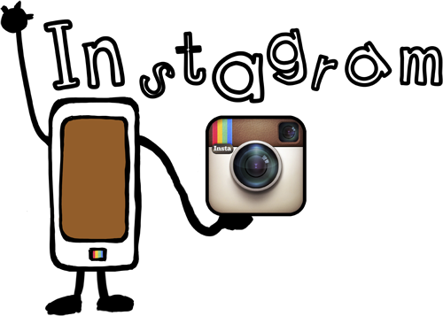

# Aplicaciones Didácticas

**Docentes**

Mediante esta aplicación, podrás:

*   Documentar las actividades de aula, mediante una etiqueta o hashtag.
    
*   Dar difusión a una actividad/ evento escolar.
    
*   Generar contenidos orales/ escritos a partir de la visualización de una imagen.
    
*   Favorecer la interacción con el entorno de nuestros alumnos, mediante la captación de imágenes y modificación con filtros, relacionadas con nuestras materias (Ej. la geometría que nos rodea).
    
*   Generar una línea de tiempo visual.

**Alumnos**

Mediante esta aplicación, podrás:

*   Dar un valor añadido a sus trabajos, con la inclusión de imágenes propias.
    
*   Relacionar el uso de redes sociales con aprendizaje, y no sólo con ocio. Conectar sus publicaciones escolares con Twitter.