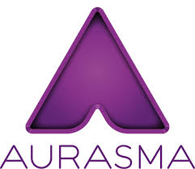

# Aurasma

App multiplataforma de Realidad Aumentada. Empleando  la cámara del smartphone y  haciendo uso de las funcionalidades de la app tendremos diversas posibilidades:

Seguir canales en los que se nos ofrecen diversos contenidos aumentados, creados previamente por otros usuarios. Con la cámara se podrán identificar imágenes u objetos y a tiempo real se superpondrá el contenido virtual vinculado.

  
Crear nuestras propias auras, al vincular a una imagen u objeto el contenido virtual que nosotros deseemos.

****

**Acceder a la aplicación**:

[Aurasma en iTunes](https://itunes.apple.com/es/app/aurasma/id432526396?mt=8)

[Aurasma en Google Play](https://play.google.com/store/apps/details?id=com.aurasma.aurasma&hl=es)

Imagen de Android en [Flickr](https://www.flickr.com/photos/ericajoy/2951483568/). Licencia CC-BY-NC 3.0 ES

 [Aurasma en la web](http://www.aurasma.com/#/whats-your-aura)

