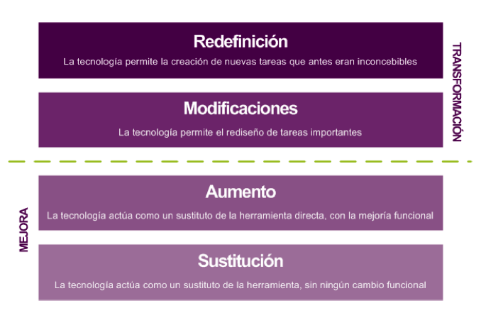

# ¿Cómo lo hacemos?

Según señala Marcelo Rinaldi en “Revolución Mobile-Learning” (1) cada nueva herramienta encierra un potencial educativo que exige exploración. Es normal que los docentes atraviesen por diversas fases en el proceso de integración de las nuevas tecnologías o herramientas. No es infrecuente que algunos educadores no vayan más allá del aspecto tecnológico; puede incluso suponer una marcha atrás en terreno pedagógico, aunque puede tratarse de un inicio normal. En cualquier caso, es necesario ir más allá. En lo referente al m-learning, Rinaldi señala estas etapas:

1.  Uso básico de las herramientas tecnológicas: los alumnos aprenden a través de ellas pero no sirven para generar conocimiento compartido
2.  "Action Learning” se basa en la aplicación práctica de los conceptos teóricos aprendidos gracias a la experiencia personal
3.  “Authentic Learning”, propone la creación de escenarios parecidos a la vida cotidiana para experimentar lo aprendido en un entorno “real” y con un enfoque multidisciplinar.

Tíscar Lara (2), nos habla de dos posibles enfoques metodológicos que aprecia en los proyecto de m-learning:

  
a) Centrado en **la producción de contenidos**. Los dispositivos móviles se entienden y utilizan como una forma de hacer llegar el contenido a los estudiantes. Suele encontrarse en contextos educativos formales.

b) Centrado en **el diseño de actividades**. Centrado en **el estudiante** como actor principal. Requiere la planificación del trabajo autónomo del estudiante. Aparece con mayor frecuencia en contextos educativos informales.

Ambos enfoques son valiosos, aunque su alcance sea distinto. En este sentido el **modelo SARM** propuesto por Rubén Puentedura (3) nos ofrece el posible recorrido en cuatro fases que se distribuye en dos etapas: **mejora** y **transformación**.

En la fase de **Sustitución** la tecnología actúa como un mero sustituto sin aportar nuevas funcionalidades, p.e. sustituimos el libro de texto por un pdf, en la fase de **Aumento** se añade a esa sustitución alguna mejora funcional, p.e. podemos enriquecer el texto añadiendo algunos elementos interactivos. En cualquier caso se produce una mejora.

El objetivo es la transformación que empieza a producirse en la fase denominada de **Modificación**.En ella los alumnos y alumnas realizan la mayor parte de las tareas del aula utilizando las tecnologías, permitiendo la retroalimentación entre pares y con el profesor, la re-escritura o actividades como la grabación de audio. En último nivel se sitúa la **Redefinición**,que se describe como la posibilidad de realizar actividades antes inconcebibles, por ejemplo la realización de un documental sobre algún concepto importante. En esta fase los estudiantes trabajan cooperativamente para desarrollar un mismo proyecto. La tecnología presta el soporte para la necesaria comunicación entre los alumnos y dará soporte a la investigación.

Imagen procedente de [Tíscar.com](http://tiscar.com/2013/06/20/mlearning-cuando-el-caballo-de-troya-entro-en-el-aula/).

En la siguiente presentación puedes ver una ejemplificación de este modelo y la introducción a algunos otros SARM

**[Diseñar experiencias de aprendizaje movil](https://es.slideshare.net/pazgonzalo2/disear-experiencias-deaprendizajemovil-31609975 "Diseñar experiencias de aprendizaje movil")** de **[Paz Gonzalo](http://www.slideshare.net/pazgonzalo2)**

\_\_\_\_\_\_\_\_\_\_\_\_\_\_\_\_\_\_\_\_\_\_\_\_\_\_\_\_\_

NOTAS

(1) Rinaldi, Marcello (2012). "Revolución Mobile Learning. 15 clases en 15 días". e-book disponible en Amazon.

(2) #MLEARNING Cuando El Caballo De Troya Entró En El Aula - TISCAR :: Comunicación y Educación En La Era Digital."TISCAR Comunicación Y Educación En La Era Digital”. Web. 08 Julio 2014. <[http://tiscar.com/2013/06/20/mlearning-cuando-el-caballo-de-troya-entro-en-el-aula/](http://tiscar.com/2013/06/20/mlearning-cuando-el-caballo-de-troya-entro-en-el-aula/)>.

(3) "Learning and Teaching Considerations." - Jisc InfoNet. Web. 08 June 2014. <[http://www.jiscinfonet.ac.uk/infokits/mobile-learning/pedagogy/learning-teaching-considerations/](http://www.jiscinfonet.ac.uk/infokits/mobile-learning/pedagogy/learning-teaching-considerations/)>.