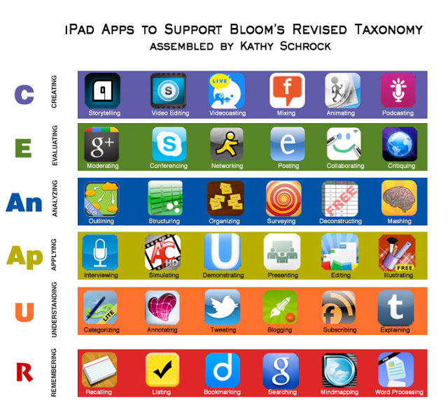

# Dónde encontrar apps

La elección de aplicaciones va a requerir su tiempo. Especialmente si optamos por el modelo BYOD, tendremos que buscar apps que tengan versiones para los distintos sistemas operativos y si no es posible, buscar apps similares en cuanto a prestaciones.

Para ayudarte en esta tarea hemos hecho una selección de sitios donde puedes explorar posibilidades.

**Proyecto Guappis** (castellano - Android y iOS)

Es un [proyecto colaborativo](http://proyectoguappis.blogspot.com.es/) de docentes que aportan sus descubrimientos y experiencias. Las apps se pueden buscar por nombre, por contenido, tipo, por capacidades, por etapa educativa, por precio y por sistema operativo.

**Appitic (inglés- iOS)**  

Quizás el mayor [repertorio de apps para iOS](http://www.appitic.com/) con interesantes clasificaciones: temática, distintas metodologías como flipped, ABP, alumnos con necesidades educativas especiales, redes, webcast, profesor, inteligencias múltiples y también la Taxonomía de Bloom.

**Edtechteacher (inglés)**  

Nos ofrece un [repertorio de apps](http://edtechteacher.org/apps/#Begin) con una buena clasificación. Podemos iniciar la búsqueda por tipo de dispositivo y por tipo de actividad. Para cada app encontraremos una breve descripción, valoración de su utilidad, de su facilidad de uso y precio.

**Eduapps (Español - IOS)**

Importante [repertorio de apps educativas](http://eduapps.es/index.php) para Ipad. Las aplicaciones están organizadas por niveles educativos, también hay una selección para profesores y una clasificación basada en la Taxonomía de Bloom. Las apps son valoradas y comentadas por los usuarios .

**Android4school.com (inglés - Android)** 

Se accede a las [apps](http://www.android4schools.com/%20) mediante la nube de términos claves que encontramos en la columna lagerarl en la que se incluyen tipos de actividades y contenidos.

Imagen procedente de [Kathy Schrock's Guide to Everything](http://www.schrockguide.net/bloomin-apps.html)