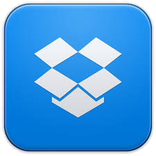

# Dropbox

**Dropbox **es una herramienta que nos permite sincronizar nuestros archivos a través de un disco duro virtual (en la nube), accesible desde cualquier ordenador. Podemos crear una carpeta en nuestro PC y tener una copia, de dichos archivos, almacenados en la nube.

Cualquier cambio que hagamos en el archivo, **Dropbox** lo detecta y hace una nueva copia, manteniendo la versión más antigua evitando, así, la pérdida de información.

Podemos compartir archivos o carpetas con otros usuarios y está disponible en versión web y en aplicación móvil.

Ofrece de modo gratuito, 2 GB de almacenamiento, si bien se pueden obtener hasta 18 GB recomendando el servicio a otros usuarios. Si se precisa de más espacio en la "nube", habrá que acudir a los diferentes planes de precios.

 

**Descarga la aplicación**:

[Dropbox en itunes ](https://itunes.apple.com/es/app/dropbox/id327630330?mt=8)  

[DropBox en GooglePlay](https://play.google.com/store/apps/details?id=com.dropbox.android&hl=es)

Imagen de Android en [Flickr](https://www.flickr.com/photos/ericajoy/2951483568/). Licencia CC-BY-NC 3.0 ES.