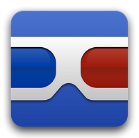
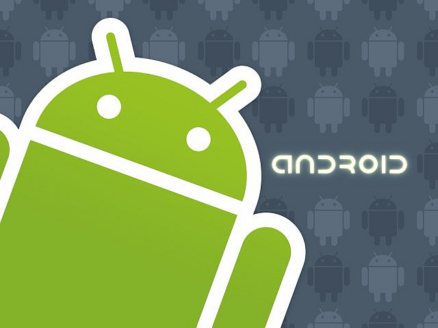

# Goggles

**Google Goggles** es una aplicación para sistemas Android orientada a Realidad Aumentada que convierte mágicamente una fotografía, un código QR, un texto en un resultado de búsqueda. Esta aplicación permite también resolver sudokus, traducir textos, buscar productos similares… Es realmente útil.

Para dispositivos con sistema iOS está integrada en el buscador de Google.

_NOTA: De momento no funciona en IOS 7._

 

**Descarga la aplicación:**

[Google Goggles en itunes](https://itunes.apple.com/us/app/google-search/id284815942?mt=8)   

[Google Goggles en GooglePlay](https://play.google.com/store/apps/details?id=com.google.android.apps.unveil&hl=es)

Imagen de Android en [Flickr](https://www.flickr.com/photos/ericajoy/2951483568/). Licencia CC-BY-NC 3.0 ES.