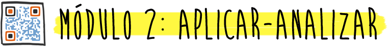

# Analizar

## 

En este módulo vas a:

*   Aprender a analizar la información, mediante el uso de apps.
*   Profundizar en el conocimiento de la información manejada.
*   Identificar, y descubrir, relaciones y patrones existentes en los contenidos trabajados.
*   Generar un mapa mental de forma colaborativa, descomponiendo un concepto dado en sus diversas partes y estableciendo las relaciones entre ellas.
*   Dividir la información en partes más simples, integradas en un todo visual uniforme, mediante la creación y lectura de un código QR.