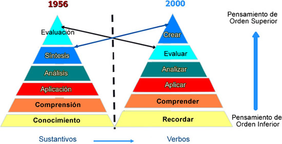
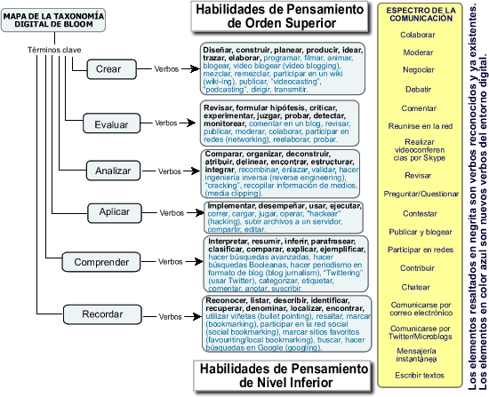
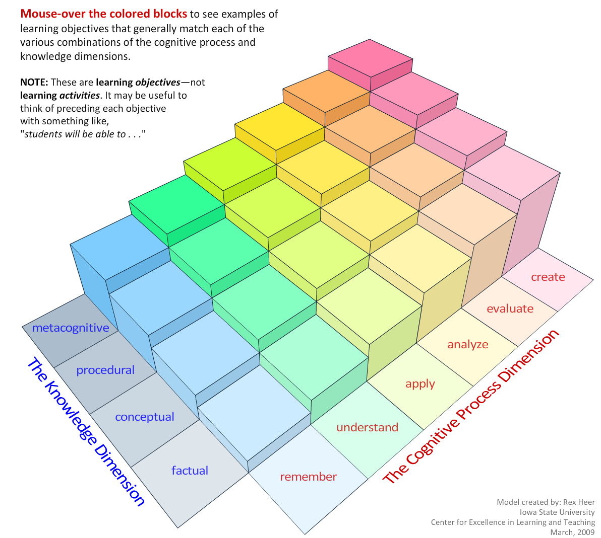

# La taxonomía de Bloom

En este curso hemos tomado como referencia  la [**Taxonomía de Bloom**](http://www.eduteka.org/pdfdir/TaxonomiaBloomCuadro.pdf "Cuadros resumen de las distintas versiones de la Taxonomía de Bloom") en su versión para la era digital. Antes de seguir adelante describiremos brevemente en que consiste (1). 

La propuesta original de Bloom data del año 1956 y establece una jerarquía de objetivos educativos que van vinculados a determinadas habilidades de pensamiento. Partiendo de las habilidades de pensamiento inferiores se va avanzado hasta la adquisición de las habilidades cognitivas superiores. Esta taxonomía es revisada por Anderson y Krathwohl que introduce dos cambios importantes: Las categorías pasan a ser descritas mediante verbos y sitúan la creatividad en el nivel más alto.

Imagen procedente de [Eduteka](http://www.eduteka.org/TaxonomiaBloomCuadro.php3).

Andrew Churches (2008) realiza una actualización de la taxonomía de Anderson para adaptarla a la era digital complementándola con verbos y herramientas del mundo digital que posibilitan el desarrollo de los distintos niveles cognitivos (2). Por nuestra parte lo que haremos será vincular algunas aplicaciones para móviles a cada categoría y proponer alguna actividad representativa, sin ánimo de ser exhaustivos. No debe entenderse que una aplicación vinculada a un nivel en este curso, sólo es útil en ese nivel, puesto que puede tener otras muchas posibilidades.

Imagen procedente de [Eduteka](http://www.eduteka.org/TaxonomiaBloomDigital.php).

**Taxonomía de Bloom interactiva**

Para interactuar con la animación correspondiente a la imagen de abajo, visita el [enlace](http://www.celt.iastate.edu/multimedia/RevisedBlooms5.swf) original.

\_\_\_\_\_\_\_\_\_\_\_\_\_\_\_\_\_\_\_\_\_\_\_\_

NOTAS

(1) "Eduteka - Taxonomía De Bloom De Habilidades De Pensamiento."_Eduteka - Taxonomía De Bloom De Habilidades De Pensamiento_. Web. 15 JulIo 2014. <[http:/](http://www.eduteka.org/TaxonomiaBloomCuadro.php3)[/www.eduteka](http://www.eduteka.org/TaxonomiaBloomCuadro.php3)[.org/TaxonomiaBloomCuadro](http://www.eduteka.org/TaxonomiaBloomCuadro.php3)[.php3](http://www.eduteka.org/TaxonomiaBloomCuadro.php3)>

(2) "Eduteka - Taxonomía De Bloom De Habilidades De Pensamiento."_Eduteka - Taxonomía De Bloom De Habilidades De Pensamiento_. Web. 15 July 2014. <[http:/](http://www.eduteka.org/TaxonomiaBloomCuadro.php3)[/www.eduteka](http://www.eduteka.org/TaxonomiaBloomCuadro.php3)[.org/TaxonomiaBloomCuadro](http://www.eduteka.org/TaxonomiaBloomCuadro.php3)[.php3](http://www.eduteka.org/TaxonomiaBloomCuadro.php3)>