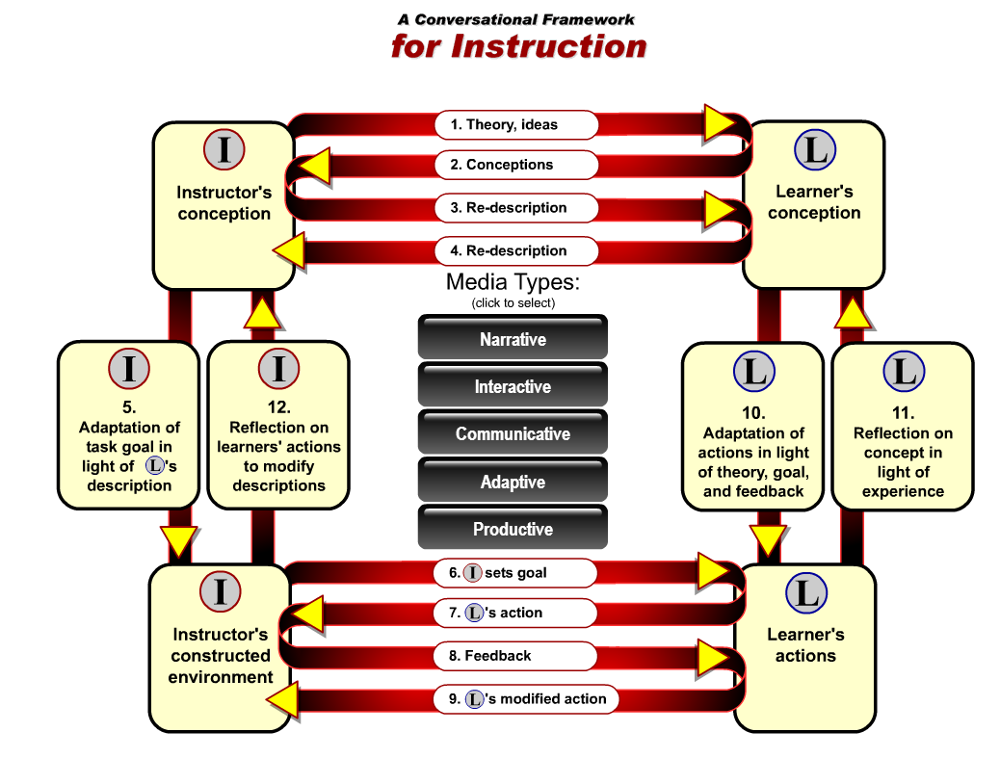

# Marco de Laurillard

**Laurillard** (2002) (1) – Aboga por  un marco conversacional para el uso efectivo de las tecnologías de aprendizaje.

Las principales funciones de la tecnología móvil serían el apoyo al "aprendizaje conversacional": proporcionar un entorno para permitir la conversación, permitiendo a los estudiantes a construir modelos con el fin de resolver problemas.

Este modelo se compone de cuatro componentes:

*   **El profesor**
*   **Ambiente de aprendizaje construido por el profesor**
*   **El alumno**
*   **Acciones específicas del estudiante (relacionados con las tareas de aprendizaje).**

Cada escenario pedagógico debe incluir los cuatro tipos de actividades que se señalan a continuación (formas de comunicación) del que resultan 8 clases de "flujos" en el modelo.

**(1) Discusión** entre el profesor y el alumno

*   Las ideas y teorías de alumnos y profesores deben ser mutuamente accesibles
*   Ambos deben estar de acuerdo en los objetivos de aprendizaje

**(2) Adaptación** de las acciones de los alumnos y del entorno construido del profesor

*   Profesor debe adaptar los objetivos en cuanto a las concepciones existentes
*   Estudiantes deben integrar la retroalimentación y vincularlo a sus propias concepciones

**(3) Interacción** entre el alumno y el entorno definido por el profesor

*   Profesor debe crear un entorno adaptado a la tarea de aprendizaje dada al alumno
    
*   Maestro debe centrarse en el apoyo a la tarea y dar retroalimentación apropiada para el alumno  
    

**(4) Reflexión** del desempeño del alumno por el profesor y el alumno

*   Maestro debe apoyar al alumno para revisar sus concepciones y adaptar la tarea a las necesidades de aprendizaje
    
*   Los alumnos deben reflexionar con todas las etapas del proceso de aprendizaje (conceptos iniciales, tareas, objetivos, comentarios, ...)
    

 

Imagen procedente de [Infokits](http://www.jiscinfonet.ac.uk/infokits/mobile-learning/)

\_\_\_\_\_\_\_\_\_\_\_\_\_\_\_\_\_

NOTAS

(1) "Laurillard Conversational Framework." - EduTech Wiki. Web. 13 Julio 2014 < [http://edutechwiki.unige.ch/en/Laurillard\_conversational\_framework](http://edutechwiki.unige.ch/en/Laurillard_conversational_framework) >