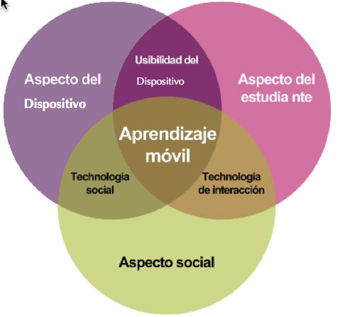

# Modelo de Koole

**M. Koole** (2009) (1) - Nos presenta  un modelo denominado **Frame** (marco)  que representa mediante un diagrama de Venn de tres círculos que comprenden el aspecto del  **Estudiante**, el aspecto **Social** y el aspecto del **Dispositivo** de manera que existen intersecciones entre estos componentes:

*   **Los dispositivos (D)**: tiene en cuenta aspectos como características físicas, capacidades de entrada y salida, almacenamiento de archivos y recuperación, la velocidad del procesador, etc.
    
*   **Los Estudiantes (L)**: se tienen en consideración características personales, conocimientos previos, estilos de aprendizaje, memoria, emociones, antecedentes personales y la capacidad de transferir conocimientos y habilidades.
    
*   **Aspecto Socia****l (S)**: tiene en cuenta los procesos de conversación y la cooperación, el intercambio de signos y símbolos, así como las creencias y los valores sociales y culturales.
    

Siguiendo a la propia M. Koole, es en las intersecciones de estos tres aspectos donde aparecen los ámbitos de interés para el análisis. Cuando estos aspectos se solapan entre sí, empezamos a ver novedades interesantes. Como alumno, entra en contacto con un dispositivo según el dispositivo: **Usabilidad** Intersección (DL); podemos considerar elementos como la portabilidad, la disponibilidad de información, bienestar psicológico, y la satisfacción con la estética y la funcionalidad. En la **Tecnología Intersección Social (DS**) consideramos cómo las personas vistas como colectivo interactúan con la tecnología. Por lo tanto, podemos considerar los medios de _networking_, conectividad entre los sistemas y herramientas de colaboración. Finalmente, con la interacción de **Aprendizaje** Intersección (LS), lo que salta a la vista es cómo un individuo está influenciado por el ámbito social. Aquí es donde podemos considerar las ideas constructivistas y construccionistas como el tipo de interacción, cognición situada, y las comunidades de aprendizaje.

En el centro del modelo, los aspectos y las intersecciones nos informan de la naturaleza del contexto de aprendizaje. Es en este el punto en el que podemos considerar la mediación, el acceso y selección de información, así como el conocimiento.

Imagen procedente de [Infokits](http://www.jiscinfonet.ac.uk/infokits/mobile-learning/)

Para poner el foco en los estudiantes en lugar de en la tecnología, Koole nos propone una serie de preguntas que las instituciones decididas a incorporar el aprendizaje móvil deberían responder (2):

1\. ¿Cómo el uso de dispositivos móviles puede cambiar el proceso de interacción entre los estudiantes, las comunidades y los sistemas?

2\. ¿Cómo pueden los estudiantes utilizar con mayor eficacia el acceso móvil a otros estudiantes, los sistemas y dispositivos para reconocer y evaluar la información y los procesos para lograr sus objetivos?

3\. ¿Cómo pueden los estudiantes ser más independientes en la navegación y en la filtración de la información?

4\. ¿Cómo va a cambiar el papel de los profesores y estudiantes y cómo se prepara para ese cambio?

\_\_\_\_\_\_\_\_\_\_\_\_\_\_\_\_\_\_\_\_\_\_\_

NOTAS

(1) "Mobile Learning: Is the FRAME Model Still Current?" _Thoughts Writing Snippets RSS_. Web. 15 JulIO 2014. <[http://kooleady.ca/thoughts/?p=619](http://kooleady.ca/thoughts/?p=619)>.

(2) "Home." _Mobile Learning Infokit /_. Web. 15 Julio 2014. <[http://www.jiscinfonet.ac.uk/infokits/mobile-learning/](http://www.jiscinfonet.ac.uk/infokits/mobile-learning/) >.