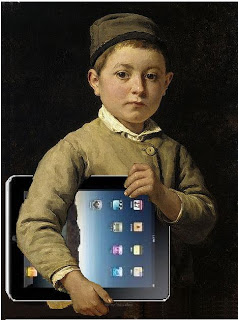

# Modelo de Naismith

El uso que se haga de la tecnología móvil puede adecuarse a distintas teorías del aprendizaje. **Naismith **(1), tras realizar una investigación sobre buenas prácticas en el uso del aprendizaje móvil, elabora  una clasificación que relaciona los distintos tipos de actividades o usos educativos de los dispositivos móviles con los diferentes modelos educativos y contextos: 

*   **Conductista** \- las actividades que promueven el aprendizaje como un cambio en las acciones observables de los estudiantes. En el paradigma conductista, se cree que el aprendizaje se facilita a través del refuerzo de una asociación entre un estímulo particular y una respuesta. Aplicando esto a la tecnología educativa, el aprendizaje asistido por ordenador sería un ejemplo: la presentación de un problema (estímulo), seguido de la aportación por parte del alumno de la solución (respuesta) y el refuerzo instantáneo al recibir el _feedback_ de la repuesta correcta.  

*   **Constructivista** \- actividades en las que los estudiantes construyen activamente nuevas ideas o conceptos basados en los conocimientos previos y actuales a través de la experimentación y la reflexión. Las actividades clásicas en este caso son la resolución de un reto o situación que implique la búsqueda de información, selección, tratamiento de la misma, análisis, debate y propuesta de solución.

*   **Situada** \- las actividades que promueven el aprendizaje dentro de un contexto y cultura auténticos. La diferencia con el planteamiento anterior es que en este caso el reto tiene lugar en una situación real.

*   **Colaborativa** \- las actividades que promueven el aprendizaje mediante la interacción social. Este planteamiento educativo tiene su reflejo en la multitud de aplicaciones que posibilitan el trabajo en equipo, el intercambio de información y la comunicación.

*   **Informal y para toda la vida** \- las actividades que apoyan el aprendizaje fuera de un ambiente de aprendizaje formal y del plan de estudios oficial. Está enfocado a los intereses o necesidades personales, se trata de un aprendizaje más libre.

*   **El aprendizaje y apoyo a la docencia **\- actividades que ayudan en la coordinación de los alumnos y los recursos para las actividades de aprendizaje. En este caso son los docentes quienes usan la tecnología móvil en su propio beneficio, tanto para mejorar la tareas de gestión y organización como para establecer relaciones profesionales de colaboración con otros compañeros.

Imagen procedente de: [https://www.flickr.com/photos/notionscapital/](https://www.flickr.com/photos/notionscapital/)

\_\_\_\_\_\_\_\_\_\_\_\_\_\_\_\_\_\_\_\_\_\_\_\_\_\_\_\_

NOTAS

(1) "Resources Archive." _Futurelab_. Web. 14 Julio 2014. <[http:/](http://archive.futurelab.org.uk/resources/publications-reports-articles/literature-reviews/Literature-Review203)[/archive.futurelab](http://archive.futurelab.org.uk/resources/publications-reports-articles/literature-reviews/Literature-Review203)[.org.uk/resources](http://archive.futurelab.org.uk/resources/publications-reports-articles/literature-reviews/Literature-Review203)[/publications-reports-articles](http://archive.futurelab.org.uk/resources/publications-reports-articles/literature-reviews/Literature-Review203)[/literature-reviews](http://archive.futurelab.org.uk/resources/publications-reports-articles/literature-reviews/Literature-Review203)[/Literature-Review203](http://archive.futurelab.org.uk/resources/publications-reports-articles/literature-reviews/Literature-Review203)>.