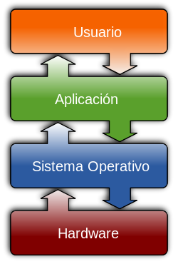

# Modelos de introducción de m-learning

Hay tres elementos que configuran la tecnología móvil: son los **dispositivos**, la **conectividad** y las **aplicaciones para móviles (apps)**.

**Los dispositivos**

Existe una gran diversidad de dispositivos móviles en el mercado como lectores de ebook, tablets, phablets y teléfonos que difieren en cuanto a prestaciones: tamaño de pantalla, táctiles o no; resolución de la misma, tipo de procesador, conexión wifi, 3G o 4G, memoria de almacenamiento y memoria RAM, etc. De todas esas especificaciones una de las más importantes a considerar es [el sistema operativo](http://es.wikipedia.org/wiki/Sistema_operativo) que utilizan que va a condicionar las funcionalidades del dispositivo y las aplicaciones que se pueden utilizar.

Los sistemas operativos dominantes en dispositivos móviles son iOS y Android.  [iOS](http://es.wikipedia.org/wiki/IOS_(sistema_operativo)) pertenece a Apple, es utilizado por Ipad y IPhone. [Android](http://es.wikipedia.org/wiki/Android) está presente en muchas marcas como Samsung, Motorola, Bq y muchos otros. Pero estos dos sistemas no son los únicos, Microsoft también dispone del suyo:Windows Phone, utilizado por Nokia desde 2011. Por su parte los teléfonos Blackberry funcionan sobre [Blacberry OS](http://es.wikipedia.org/wiki/BlackBerry_OS). En este curso hemos buscado aplicaciones que funcionen tanto para Android como para iOS.

Una de las grandes decisiones a adoptar es el modelo que se va a seguir para introducir el m-learning. Existen básicamente tres vías para introducir los dispositivos móviles en el aula, en función de quien proporciona los medios:

1.  El centro o administración educativa proporciona estos medios, de manera similar a como se hizo en el programa “Escuela 2.0”, modelo 1:1 (un ordenador un niño).
2.  Un sistema mixto en el que se utilizan tanto dispositivos proporcionados por el centro como los que aportan los propios profesores y alumnos.
3.  El modelo BYOD o BYOT, (_Bring your own device_ o _Bring your own technology_) trae tu propio dispositivo o tecnología” en la que profesores y alumnos aportan su propia tecnología.

La primera opción tiene como ventaja un acceso más equitativo, ya que no depende de la capacidad económica de cada cual y también simplifica la implementación, tanto desde el punto de vista de la formación como desde el punto de vista técnico. El gran inconveniente es el coste que supone para el centro o la administración educativa. En el segundo caso los centros cubren una parte del coste de los dispositivos y de la conexión. Según apunta en el informe Horizon k-12 2014 BYOD (1)   se está convirtiendo en la tendencia y constituye la oportunidad para apoyar el aprendizaje dentro y fuera del aula ya que para la instituciones el modelo 1:1  supone un esfuerzo presupuestario.

Imagen procedente de [http://es.wikipedia.org/wiki/Sistema_operativo](http://es.wikipedia.org/wiki/Sistema_operativo)

\_\_\_\_\_\_\_\_\_\_\_\_\_\_\_\_\_\_\_\_\_

NOTAS

(1) Eduteka. "Aprendizaje móvil y políticas". Julio 2014. < [http://www.eduteka.org/pdfdir/UNESCO-4-aprendizaje-movil-cuestiones-clave2013.pdf](http://www.eduteka.org/pdfdir/UNESCO-4-aprendizaje-movil-cuestiones-clave2013.pdf) >