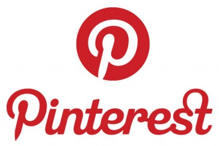

# Pinterest

**Pinterest** es una red social en la que el contenido que se comparte es en forma de imagen. Los usuarios pueden suscribirse a diferentes temáticas (tablones) y subir imágenes y fotografías (pines), añadiendo un breve comentario (de un máximo de 500 caracteres).

De esta forma, pueden organizar fotos de manualidades, asignaturas, viajes o celebraciones.

Se pueden publicar contenidos sin necesidad de entrar en la red social, ya que los navegadores cuentan con publicación directa en dicha red social. También puedes descargarte el _Pin it button_ en el [navegador](https://about.pinterest.com/en/goodies) que uses.

**Descarga la aplicación**:

[Pinterest en itunes](https://itunes.apple.com/es/app/pinterest/id429047995?mt=8)  

[Pinterest en GooglePlay](https://play.google.com/store/apps/details?id=com.pinterest&hl=es)    

Imagen de Android procedente de [Flickr](https://www.flickr.com/photos/ericajoy/2951483568/). Licencia CC-BY-NC 3.0 ES