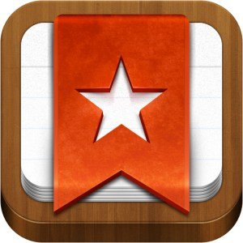

# ¿Qué Apps podemos usar en este nivel?

Enlace al vídeo: [http://youtu.be/3EGw6L3KUAQ](http://youtu.be/3EGw6L3KUAQ)

Utilizaremos algunas Apps que nos van a ayudan a recordar:

El **correo electrónico** es el soporte de una gran cantidad de información. Dependiendo del proveedor, nos permitirá clasificar y ordenar la información mediante etiquetas o carpetas; gestionar nuestra red de contactos; y disponer de otras funcionalidades tales como llevar una agenda de trabajo o calendario, alarmas automáticas, etc.

Imagen de Javier Briones en [flickr](https://c1.staticflickr.com/9/8551/9026700946_900a0e0d05.jpg). Licencia CC-BY-NC 3.0 ES  

**Evernote**. Esta herramienta nos facilita recordar todo tipo de información: notas de texto, de voz, imágenes, enlaces web, capturas de pantalla; organizar la información mediante carpetas y etiquetas, dándonos la opción de compartirlas. Una de las ventajas de esta aplicación es que permite trabajar sin conexión (offline).

**Google** es uno de los buscadores más utilizados a nivel mundial. Está integrado con todas las herramientas Google: Drive, Maps, Imágenes, etc. lo cual permite encontrar información multimedia, páginas web, videos, mapas, etc.

**Diigo.** Esta herramienta nos permite marcar nuestros favoritos online, de manera que, siempre que tengamos conexión, podamos acceder a ellos y compartirlos con otras personas o usuarios. Para ello utiliza las etiquetas y otras funcionalidades como introducir comentarios y subrayar.

**Wunderlist**. Es un gestor de tareas mediante la creación de listas que pueden ser compartidas con otros usuarios.

**Pinterest**. Es un gestor gráfico muy visual y atractivo mediante el que podemos crear tableros temáticos donde publicar imágenes, compartirlas y referenciar su origen.

