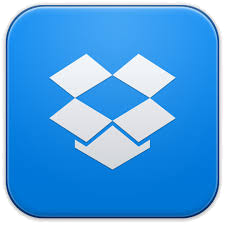

# ¿Qué Apps podemos usar en este nivel?

Enlace al vídeo: [https://www.youtube.com/watch?v=ylDnssuNep8&list=PL7O-wFTtwWAaZrRthKeOKt-82wfuRJuhJ](https://www.youtube.com/watch?v=ylDnssuNep8&list=PL7O-wFTtwWAaZrRthKeOKt-82wfuRJuhJ)

Utilizaremos algunas Apps que nos van a ayudan a APLICAR:

**Haiku Deck** es una app gratuita con la que puedes crear y compartir una presentación desde cualquier lugar. Puedes plasmar tus ideas de una forma amena y muy entretenida gracias a la posibilidad de combinar textos con imágenes. Da la posibilidad de crear diseños originales, al estar previamente incorporados en la aplicación.

**QuickOffice** es una aplicación que funciona a modo de paquete ofimático en tu dispositivo móvil. Permite  visualizar y editar documentos de texto, presentaciones y hojas de cálculo. Es totalmente transparente con la aplicación nativa de Google Drive.

**Dropbox** es una aplicación que permite gestionar tu disco duro en la nube. Desde ella puedes crear carpetas, subir archivos, visualizarlos, moverlos y copiarlos en carpetas, etc. También permite compartir los archivos o carpetas con otros usuarios de forma privada o pública mediante la generación de enlaces.

**Instagram** es una red social de usuarios que comparten fotografías y vídeos de una forma especial y artística. Mediante el uso de etiquetas e indicadores, los usuarios (que te siguen y a quienes sigues) pueden interactuar y opinar sobre las imágenes que publicas. Las fotografías pueden ser modificadas mediante filtros y efectos originales que dan un toque personal.

