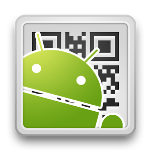

# ¿Qué Apps podemos usar en este nivel?

Enlace al vídeo: [http://www.youtube.com/watch?v=1KjLI24deEY](http://www.youtube.com/watch?v=1KjLI24deEY)

Utilizaremos algunas Apps que nos van a ayudan a Analizar:

*   **Mindmeister**. Sorprendente app para la creación de mapas mentales que incluye la posibilidad de trabajar de forma colaborativa.

Existen muchas apps móviles para creación de mapas mentales. Entre ellas, Mindmeister destaca por ser gratuita, multiplataforma y porque existe una versión web integrada dentro de las Google Apps, lo cual facilita compartir con cualquier usuario.

Disponemos de múltiples apps móviles (dependientes del dispositivo) así como páginas web, algunos ejemplos son:

*   **QR Droid**: app gratuita para Android para crear y leer códigos QR

*   [**Unitag**](https://www.unitag.io/es/qrcode "Unitag") web gratuita para crear códigos QR personalizados para direcciones url.

Nota: No existe una herramienta estándar de creación y lectura de códigos QR.