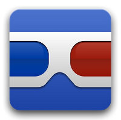

# ¿Qué Apps podemos usar en este nivel?

Enlace al vídeo: [https://www.youtube.com/watch?v=KLlp263yJTY&list=PL7O-wFTtwWAaZrRthKeOKt-82wfuRJuhJ&index=4](https://www.youtube.com/watch?v=KLlp263yJTY&list=PL7O-wFTtwWAaZrRthKeOKt-82wfuRJuhJ&index=4)

Utilizaremos algunas Apps que nos van a ayudan a comprender:

**Pearltrees** es una herramienta multiplataforma que funciona tanto en dispositivos móviles como en navegadores web. Utiliza una organización visual a través de nodos, que representan distintas categorías a las que podemos asociar todo tipo de información: páginas web, imágenes, textos, etc. También podemos compartir nuestro material seleccionado con otros.

**Skitch** es una aplicación primordialmente gráfica que nos permite capturar pantallas o secciones de la misma y posteriormente editarlas y añadirles textos, flechas, recuadros, etc. . Puede resultar muy útil para realizar explicaciones o tutoriales sencillos. Es muy fácil de manejar y con ella podemos conseguir resultados espectaculares. Es integrable con Evernote, las Google Apps y con el navegador web Chrome.

**Google Goggles** es una aplicación para sistemas Android orientada a Realidad Aumentada que convierte mágicamente una fotografía, un código QR, un texto en un resultado de búsqueda. Esta aplicación permite también resolver sudokus, traducir textos, buscar productos similares… 

