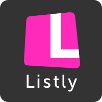

# ¿Qué Apps podemos usar en este nivel?

Enlace al vídeo: http://www.youtube.com/watch?v=pP0KAaBmlw8&list=PL7O-wFTtwWAaZrRthKeOKt-82wfuRJuhJ&index=10

Utilizaremos algunas Apps que nos van a ayudan a EVALUAR:

**Listly** es una aplicación web dedicada a la curación social de contenidos por medio listas temáticas colaborativas. Nos permite coleccionar, calificar y compartir todo tipo de recursos, ideas, opiniones o debates publicados en Internet.

**Lino**. Esta herramienta, disponible como app móvil y también en en versión web, permite crear lienzos temáticos colaborativos con notas a modo de post-its, las notas se pueden agrupar por colores, lo cual nos sirve para clasificar de un modo visual sencillo puntos de vista diversos relativos a un mismo asunto

