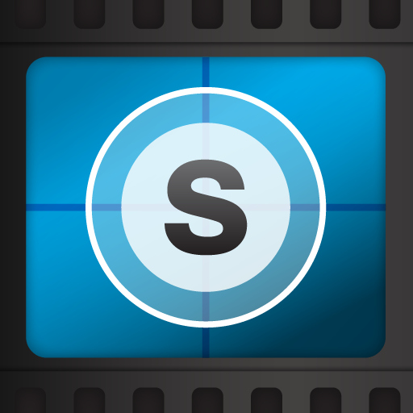
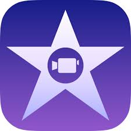
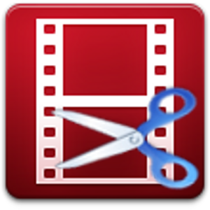
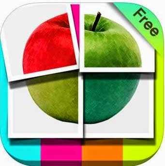
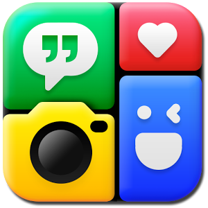

# ¿Qué Apps podemos usar en este nivel?

Enlace al vídeo: [www.youtube.com/embed/vryc-a5lK7Q](http://www.youtube.com/embed/vryc-a5lK7Q)

Utilizaremos algunas Apps que nos van a ayudan a Crear:

[**Aurasma**](http://www.aurasma.com/#/whats-your-aura)

****

App multiplataforma de Realidad Aumentada.

Para más información te aconsejamos ver el vídeo tutorial disponible en el curso.

[**SoundCloud**](https://soundcloud.com/stream)

****

Aplicación para audio gratuita multiplataforma y disponible en versión web, muy útil para grabar, edición básica de pistas, archivar y compartir.

### **Aplicaciones para grabación y edición de vídeo:**

Los dispositivos móviles integran una cámara y un micrófono que permiten la creación de vídeos.

Existen múltiples apps (dependiendo del dispositivo) para la edición de materiales audiovisuales y su difusión pública.

Algunos ejemplos son las tres aplicaciones siguientes:

 [**Splice**](http://spliceapp.com/): sencilla app para montaje de foto y vídeo para dispositivos Apple.

 [**iMovie**](https://www.apple.com/es/mac/imovie/): completa herramienta de edición de vídeo para el sistema iOS.

 [**VidTrim**](https://play.google.com/store/apps/details?id=com.goseet.VidTrim): aplicación de edición básica para el sistema Android.

 **YouTube**: app multiplataforma con muchas de las funcionalidades del canal de publicación de vídeo más utilizado. Para [iOS](https://itunes.apple.com/us/app/youtube/id544007664?mt=8) y para [Android](https://play.google.com/store/apps/details?id=com.google.android.youtube).

### **Aplicaciones para crear historias**

** [Tellagami](https://tellagami.com/)**: app libre que permite la creación y difusión de vídeos animados de forma fácil y rápida. (Compatible con iOS y Android).

### **Aplicaciones Photo Collage**

Existen muchas apps disponibles (algunas gratuitas) para todos los dispositivos móviles que permiten crear _collages _con múltiples imágenes con diseños atractivos.

 **[Photo Slice](https://itunes.apple.com/us/app/photo-slice-pro-cut-your-photo/id525610383?mt=8)**

** ** 

**Diptic**. Para [iOS](http://www.dipticapp.com/) y [Android](https://play.google.com/store/apps/details?id=com.peaksystems.diptic)

****

****Photo Grid****. Para [iOS](https://itunes.apple.com/us/app/photo-grid-video-collage-maker/id543577420?mt=8) y [Android](https://play.google.com/store/apps/details?id=com.roidapp.photogrid)

Echa un vistazo a estas páginas en las que encontrarás interesantes proyectos con RA:

*   [El Blog de Marta Reina, RA en el aula de Infantil](http://elblogdelaprofemarta.blogspot.com.es/p/ra.html)
*   [Experiencias educativas con RA en Infantil y Primaria](http://www.enlanubetic.com.es/2014/05/ra-infantil-primaria.html#.VpYLWvnhBaQ)