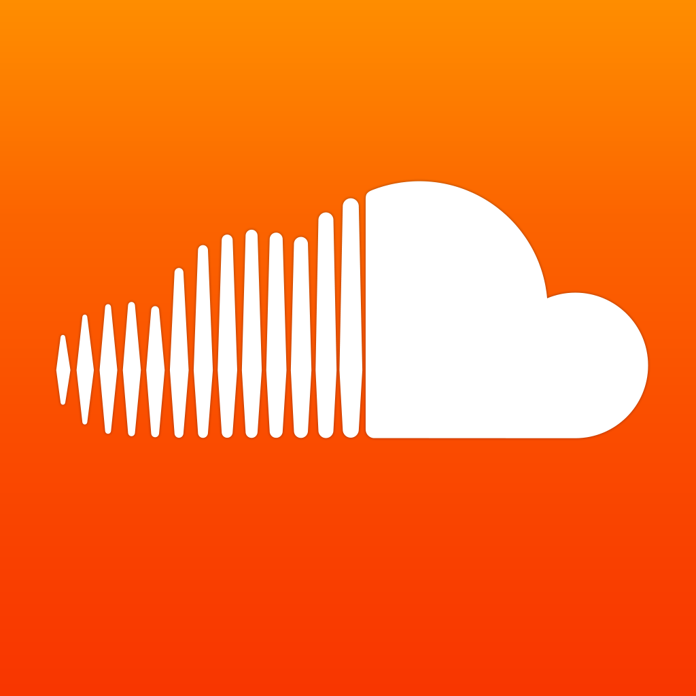

# SoundCloud

Aplicación para audio gratuita multiplataforma y disponible en versión web, muy útil para grabar, edición básica de pistas, archivar y compartir. Es una aplicación que permite encontrar música y coleccionar. Seguir a amigos y artistas, descubrir podcasts, humor y noticias. La aplicación te da diversas funcionalidades como:

*   Explorar la música y los canales de sonido más novedosos.

*   Grabar sonidos y editarlos. Compartirlos en  redes sociales.
    
*   Geoetiquetar las grabaciones con información sobre la ubicación.
    
*   Escuchar tu streaming estés donde estés usando WiFi o datos.
    
*   Escuchar listas de reproducción o crea las tuyas propias y compártelas con tus seguidores.
    

Es fácil zambullirse y empezar a descubrir música y sonidos. El registro se hace por medio de un correo electrónico, desde la versión para web o bien desde la aplicación una vez la hayas descargado en tu dispositivo móvil. Esta herramienta te da diversas posibilidades:

*   **Explorar y colecciona****r**: prueba la sección de exploración para encontrar música y sonidos novedosos de todos los géneros que puedas imaginar.
*   Mientras exploras, toca el corazón para indicar que te gusta y** guarda tus favoritos** para reproducirlos más adelante.
*   La página de **búsqueda** te permite encontrar tus pistas y artistas favoritos. Sigue sus perfiles para escuchar la nueva música que publiquen en tu _streaming_.
*   **Grabar, editar y comparti**r: la plataforma permite grabar sonido en directo desde la web, y también a través de su aplicación para dispositivos móviles.

El botón de grabación hará que sea fácil capturar todo tipo de sonidos en **SoundCloud** y si lo haces desde el dispositivo móvil será posible compartir los sonidos que captures en la calle, en una conferencia, desde la televisión o desde cualquier lado directamente hacia **SoundCloud**.

Es posible desde la aplicación grabar sonidos y editarlos, pausando la grabación, editando en el momento y continuar con la grabación. Podrás publicarlos en tu perfil y compartirlos a través de diferentes redes sociales.

**Acceder a la aplicación**:

[SoundCloud en iTunes](https://itunes.apple.com/es/app/soundcloud-musica-y-sonido/id336353151?mt=8) 

[SoundCloud en Google Play](https://play.google.com/store/apps/details?id=com.soundcloud.android&hl=es)

Imagen de Android en [Flickr](https://www.flickr.com/photos/ericajoy/2951483568/). Licencia CC-BY-NC 3.0 ES

[SoundCloud en la web](https://soundcloud.com/)  
  

